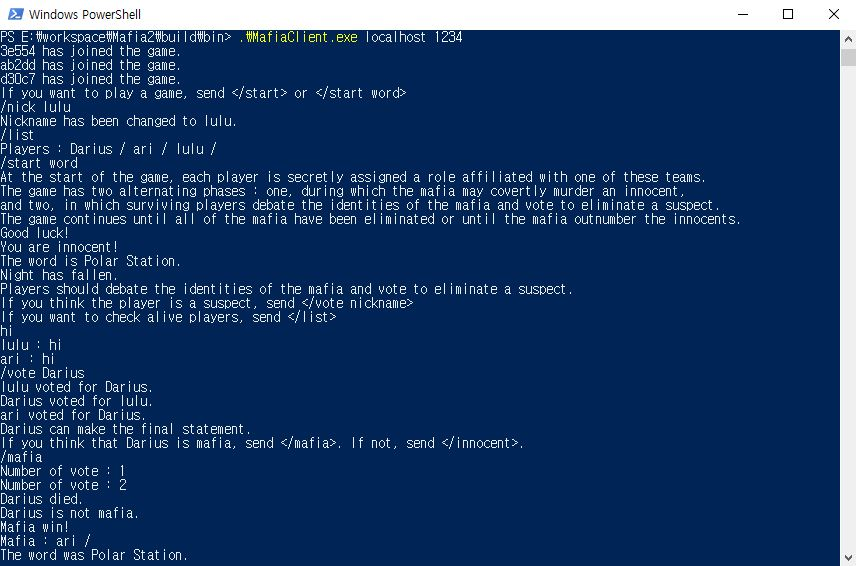

## Mafia
Mafia is a party game using chat.



### Rule
* You need at least 3 people to play the game.
* For every 3 people, there is one mafia. Example: if there are 6 people in your game, there are now two mafia
* Each player is secretly assigned a role which are can be either mafia or innocents.
* Mafia - Will kill other players and try to convince other players who the mafia is without revealing themselves
* Inncents - the most basic role, who votes and tries to figure out the mafias and vote them off
* The game continues until all of the mafia have been eliminated or until the mafia outnumber the innocents.
* (Optional) At the beginning of the game, innocents only receive the words.

## Getting Started

### Prerequisites
* cmake
* a C++11-standard-compliant compiler
* python
* pip
* conan
```sh
pip install conan
pip install pyopenssl
# Add python script path to environment variables
```

### Installation
#### For windows
Clone and run the build:
```sh
git clone https://github.com/silverthreadk/Mafia2.git
mkdir build && cd build

#Debug
conan install .. -s build_type=Debug -s compiler.runtime=MTd
#Release
conan install .. -s build_type=Release -s compiler.runtime=MT

cmake -DCMAKE_GENERATOR_PLATFORM=x64 ../
cmake --build ./ --
```
